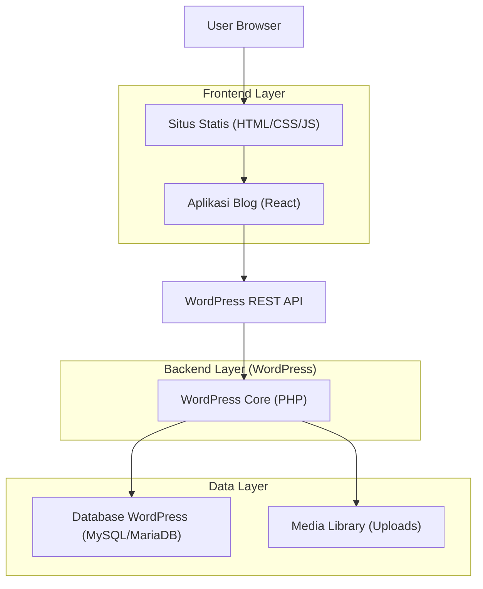
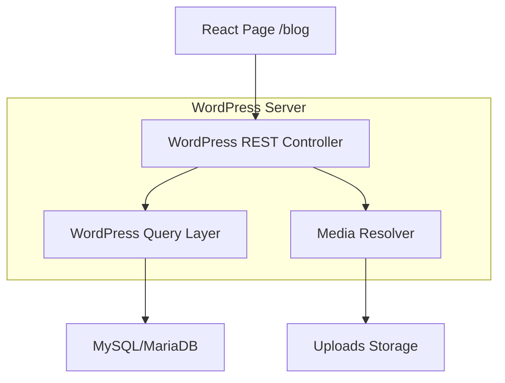
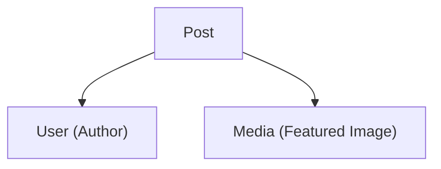

## 1.Architecture design
Rekomendasi: gunakan **Headless WordPress** sebagai CMS, lalu render blog di situs statis melalui frontend (React) agar styling bisa 1:1 mengikuti CSS halaman utama.



## 2.Technology Description
- Frontend: Situs statis yang sudah ada + React@18 + vite + react-router-dom@6 (untuk /blog) + fetch (native)
- Backend: WordPress@6 (REST API bawaan)
- Database: MySQL/MariaDB (kebutuhan bawaan WordPress)

## 3.Route definitions
| Route | Purpose |
|-------|---------|
| / | Halaman utama situs statis, menampilkan navigasi ke blog |
| /blog | Halaman daftar artikel (render dari WordPress) |
| /blog/:slug | Halaman detail artikel (render dari WordPress) |

## 4.API definitions
Catatan: ini bukan backend custom; frontend memanggil endpoint REST WordPress.

### 4.1 Endpoint yang digunakan
- Ambil daftar artikel: `GET /wp-json/wp/v2/posts?status=publish&page={n}&per_page={k}`
- Ambil artikel by slug: `GET /wp-json/wp/v2/posts?slug={slug}&status=publish`
- (Opsional bila dipakai) Ambil author: `GET /wp-json/wp/v2/users/{id}`
- (Opsional bila dipakai) Ambil media featured image: `GET /wp-json/wp/v2/media/{id}`

### 4.2 TypeScript types (digunakan di frontend)
```ts
export type WPPost = {
  id: number;
  slug: string;
  date: string;
  title: { rendered: string };
  excerpt: { rendered: string };
  content: { rendered: string };
  author?: number;
  featured_media?: number;
};

export type WPListResponse<T> = T[];
```

## 5.Server architecture diagram


## 6.Data model(if applicable)
### 6.1 Data model definition
Model data mengikuti entitas bawaan WordPress (tanpa tabel custom).



Field minimal yang dipakai di frontend:
- Post: id, slug, date, title.rendered, excerpt.rendered, content.rendered, author, featured_media
- User: id, name
- Media: id, source_url (atau field URL sejenis)

### 6.2 Data Definition Language
Tidak ada DDL custom: instalasi WordPress menggunakan skema tabel bawaan WordPress.