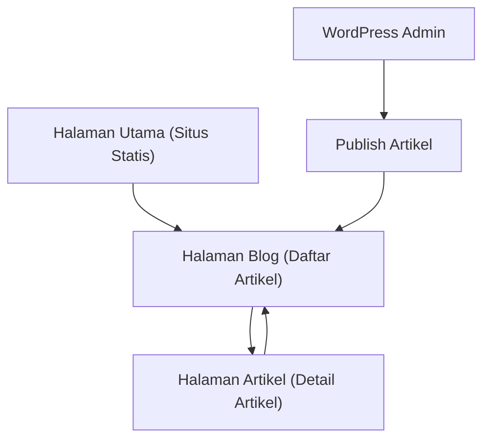

## 1. Product Overview
Menambahkan blog berbasis WordPress ke situs statis yang sudah ada.
Tampilan blog harus konsisten (CSS/komponen) dengan halaman utama, dan bisa diakses dari navigasi situs.

## 2. Core Features

### 2.1 User Roles
| Role | Registration Method | Core Permissions |
|------|---------------------|------------------|
| Pengunjung | Tanpa registrasi | Bisa melihat daftar artikel dan membaca artikel. |
| Admin/Editor (WordPress) | Login di WordPress Admin | Bisa membuat/mengubah/mempublikasi artikel blog (di WordPress), sehingga muncul di situs statis. |

### 2.2 Feature Module
Produk ini terdiri dari halaman inti berikut:
1. **Halaman Utama (Situs Statis)**: link navigasi ke Blog, penggunaan CSS global yang sama.
2. **Halaman Blog (Daftar Artikel)**: daftar artikel dari WordPress, ringkasan & metadata, pagination, state loading/error.
3. **Halaman Artikel (Detail Artikel)**: konten artikel dari WordPress, metadata artikel, navigasi kembali ke daftar.

### 2.3 Page Details
| Page Name | Module Name | Feature description |
|-----------|-------------|---------------------|
| Halaman Utama (Situs Statis) | Navigasi | Menampilkan menu/tautan “Blog” yang mengarah ke halaman daftar artikel. |
| Halaman Utama (Situs Statis) | Styling konsisten | Memakai CSS global yang sama (warna, tipografi, header/footer) sebagai acuan tampilan blog. |
| Halaman Blog (Daftar Artikel) | Pengambilan data | Mengambil artikel yang sudah dipublikasi dari WordPress dan menampilkan hasilnya. |
| Halaman Blog (Daftar Artikel) | Daftar artikel | Menampilkan kartu/list artikel berisi judul, tanggal, penulis (jika tersedia), excerpt, dan tautan ke detail. |
| Halaman Blog (Daftar Artikel) | Pagination | Menampilkan navigasi halaman berikut/sebelumnya untuk daftar artikel. |
| Halaman Blog (Daftar Artikel) | State UI | Menampilkan loading skeleton/spinner dan pesan error saat gagal memuat. |
| Halaman Artikel (Detail Artikel) | Pengambilan data | Mengambil detail artikel berdasarkan slug/ID dari WordPress. |
| Halaman Artikel (Detail Artikel) | Konten artikel | Menampilkan judul, metadata, konten (HTML dari WordPress) dengan styling yang konsisten. |
| Halaman Artikel (Detail Artikel) | Navigasi | Menyediakan tombol/tautan kembali ke halaman blog. |
| Halaman Artikel (Detail Artikel) | State UI | Menampilkan loading dan halaman “Artikel tidak ditemukan” bila slug tidak valid. |

## 3. Core Process
**Alur Pengunjung**: Kamu membuka halaman utama → klik menu “Blog” → melihat daftar artikel → memilih salah satu artikel → membaca artikel → kembali ke daftar.

**Alur Admin/Editor (WordPress)**: Kamu login ke WordPress Admin → membuat/mengedit dan mem-publish artikel → artikel tersedia untuk ditarik dan ditampilkan di halaman Blog pada situs statis.

